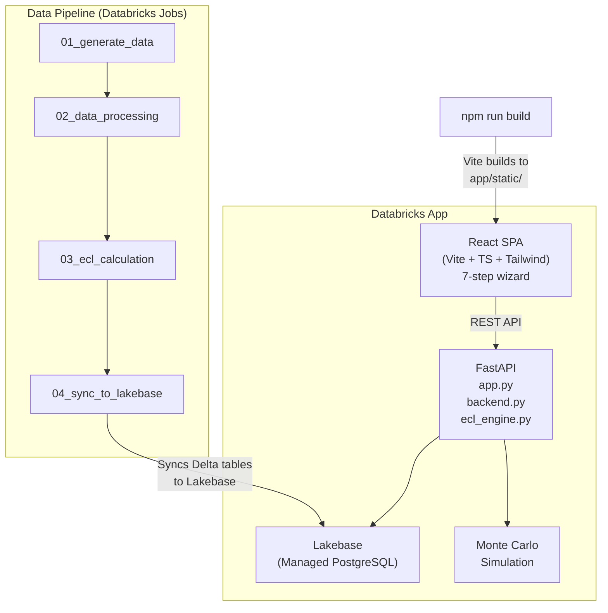

# IFRS 9 Expected Credit Loss (ECL) — Databricks Demo

A full-stack interactive demo that calculates **IFRS 9 Expected Credit Losses** using Monte Carlo simulation, powered by **Databricks Lakebase**, **Unity Catalog**, and **Databricks Apps**.

The application walks through the end-to-end ECL workflow that a bank's finance team performs every quarter: from data ingestion to CFO sign-off.

---

## What Is ECL?

Under **IFRS 9** (International Financial Reporting Standard 9), banks must estimate **forward-looking credit losses** on their loan portfolios — not just losses that have already happened, but losses they *expect* to happen based on macroeconomic forecasts.

### The Core Formula

```
ECL = Σ [ Survival(q) × PD(q) × LGD × EAD(q) × DF(q) ]
```

| Symbol | Meaning |
|--------|---------|
| **PD** | Probability of Default — likelihood a borrower stops paying |
| **LGD** | Loss Given Default — how much you lose if they default (1 − recovery rate) |
| **EAD** | Exposure at Default — outstanding balance when default occurs |
| **DF** | Discount Factor — present-value adjustment using the loan's effective interest rate |
| **Survival** | Probability the borrower hasn't defaulted in prior quarters |

### Three-Stage Impairment Model

IFRS 9 classifies every loan into one of three stages:

| Stage | Condition | ECL Horizon |
|-------|-----------|-------------|
| **Stage 1** | Performing (no significant credit deterioration) | 12-month ECL |
| **Stage 2** | Significant Increase in Credit Risk (SICR) | Lifetime ECL |
| **Stage 3** | Credit-impaired (default/90+ DPD) | Lifetime ECL |

### How This App Calculates ECL

The calculation follows a three-stage methodology:

1. **Satellite Model** — Logistic regression on 5 years of historical data derives sensitivity coefficients (β) that quantify how macro variables (unemployment, GDP, inflation) affect PD and LGD for each product type.

2. **Macro Scenario Stressing** — The β coefficients are applied to 8 forward-looking macro scenarios to produce stressed PD and LGD multipliers: `Multiplier = sigmoid(β·X_scenario) / sigmoid(β·X_baseline)`.

3. **Monte Carlo Engine** — For each loan × scenario, 1,000 correlated PD-LGD draws (via Cholesky decomposition) are simulated. The probability-weighted average across all scenarios produces the final ECL.

---

## Architecture



| Component | Technology | Purpose |
|-----------|-----------|---------|
| **Frontend** | React 19 + Vite + TypeScript + Tailwind CSS 4 | 7-step ECL workflow wizard |
| **Backend** | FastAPI + NumPy | REST API + Monte Carlo simulation engine |
| **Database** | Databricks Lakebase (Managed PostgreSQL) | Low-latency query layer for the web app |
| **Data Pipeline** | PySpark + Unity Catalog | Synthetic data generation, processing, ECL batch calculation |
| **Deployment** | Databricks Apps | Hosted application with OAuth authentication |

---

## Repository Structure

```
├── app/
│   ├── frontend/           # React + Vite + TypeScript + Tailwind
│   │   ├── src/
│   │   │   ├── pages/      # 7 workflow step pages
│   │   │   ├── components/ # Reusable UI components
│   │   │   └── lib/        # Config, API client, formatters
│   │   └── public/         # Static assets (logo)
│   ├── app.py              # FastAPI entrypoint
│   ├── backend.py          # Lakebase data access layer
│   ├── ecl_engine.py       # Monte Carlo ECL simulation engine
│   ├── requirements.txt    # Python dependencies
│   └── app.yaml            # Databricks App config
├── scripts/
│   ├── 01_generate_data.py         # Synthetic loan portfolio generation
│   ├── 02_run_data_processing.py   # Data processing & staging
│   ├── 03_run_ecl_calculation.py   # Batch ECL calculation (logistic satellite model)
│   └── 04_sync_to_lakebase.py      # Sync Unity Catalog → Lakebase
├── notebooks/
│   ├── 01_data_processing.py       # Notebook version of data processing
│   └── 02_ecl_calculation.py       # Notebook version of ECL calculation
└── README.md
```

---

## Setup Guide

### Prerequisites

- A Databricks workspace with:
  - **Unity Catalog** enabled
  - **Lakebase** (Managed PostgreSQL) provisioned
  - **Databricks Apps** enabled
  - **Serverless compute** available
- Databricks CLI installed and authenticated (`databricks auth login`)
- Node.js 18+ and npm (for frontend build)

### Step 1: Configure Your Environment

Edit `app/frontend/src/lib/config.ts` to customize for your bank:

```typescript
export const config = {
  bankName: 'Your Bank Name',
  currency: 'USD',           // or EUR, GBP, etc.
  currencySymbol: '$',       // or €, £, etc.
  currencyLocale: 'en-US',   // locale for number formatting
  country: 'United States',
  localRegulator: 'Your Central Bank',
  localCircular: 'Your Regulatory Circular',
  // ...
};
```

Also update the currency in the data generation script `scripts/01_generate_data.py` if you change from USD.

### Step 2: Create Unity Catalog Resources

Create a catalog and schema for the demo data:

```sql
CREATE CATALOG IF NOT EXISTS ecl_demo;
CREATE SCHEMA IF NOT EXISTS ecl_demo.ifrs9;
```

Update the catalog/schema references in the scripts if you use different names.

### Step 3: Run the Data Pipeline

Run the four scripts in order as Databricks notebooks or via a Databricks Job:

```
01_generate_data.py         → Creates 7 synthetic tables (loans, borrowers, payments, etc.)
02_run_data_processing.py   → Processes raw data, computes DPD, assigns IFRS 9 stages
03_run_ecl_calculation.py   → Runs logistic satellite model + Monte Carlo ECL calculation
04_sync_to_lakebase.py      → Syncs results from Unity Catalog Delta tables to Lakebase
```

You can create a multi-task Databricks Job to run these sequentially with serverless compute.

### Step 4: Create a Lakebase Instance

```bash
databricks lakebase create-database-instance \
  --instance-name your-ecl-db \
  --capacity SERVERLESS
```

Update `app/app.yaml` with your Lakebase instance name:

```yaml
env:
  - name: LAKEBASE_INSTANCE_NAME
    value: your-ecl-db
  - name: DATABRICKS_APP_NAME
    value: your-app-name
```

### Step 5: Build the Frontend

```bash
cd app/frontend
npm install
npm run build
```

This outputs the built SPA to `app/static/`.

### Step 6: Deploy the Databricks App

```bash
# From the app/ directory
databricks apps create your-app-name
databricks apps deploy your-app-name --source-code-path .
```

The app will be available at `https://<workspace>.databricks.com/apps/your-app-name`.

---

## Demo Walkthrough

The app has a **7-step workflow** that mirrors a real bank's quarter-end ECL process:

### Step 1: Create Project
- Set the reporting date and accounting framework (IFRS 9 / CECL)
- This scopes the entire ECL run

### Step 2: Data Processing
- Shows the data pipeline: loan tape extraction, borrower enrichment, payment history
- Displays portfolio summary: total loans, gross carrying amount, product distribution
- **Demo talking point**: "All data lands in Unity Catalog Delta tables — governed, versioned, and auditable"

### Step 3: Data Control Gate
- Data quality checks: completeness, GL reconciliation, duplicate detection
- Approve/reject gate before model execution
- **Demo talking point**: "No model runs until data quality is confirmed — this is the control gate"

### Step 4: Model Execution
- Shows the satellite model (logistic regression) that links macro variables to PD/LGD
- Displays the formula: `logit(PD) = β₀ + β₁×Unemployment + β₂×GDP + β₃×Inflation`
- Run Monte Carlo simulation with configurable parameters (simulations, correlation, scenarios)
- Real-time progress streaming via Server-Sent Events
- **Demo talking point**: "1,000 correlated simulations per loan per scenario — this is production-grade ECL"

### Step 5: Stress Testing
- 8 macroeconomic scenarios from baseline to tail risk
- Sensitivity analysis: tornado charts showing which variables matter most
- Vintage analysis, concentration risk, stage migration simulation
- P50/P75/P95/P99 percentile distributions
- Regulatory capital impact (CET1 ratio under stress)
- **Demo talking point**: "The CFO can see exactly how each scenario affects the bank's capital position"

### Step 6: Management Overlays
- Post-model adjustments for events the model can't capture (e.g., sector-specific layoffs)
- Each overlay is IFRS 9 referenced, has an approver, and an expiry date
- Cap control: overlays cannot exceed 15% of base ECL
- **Demo talking point**: "This is where human judgment meets the model — fully auditable"

### Step 7: Sign-Off
- IFRS 7 disclosure tables, top exposures, reconciliation
- Attestation checklist
- Lock and archive the ECL run
- **Demo talking point**: "One click to lock the quarter — everything is immutable from here"

---

## Key Terms Glossary

| Term | Definition |
|------|-----------|
| **ECL** | Expected Credit Loss — forward-looking estimate of credit losses |
| **PD** | Probability of Default — likelihood of borrower default |
| **LGD** | Loss Given Default — proportion of exposure lost if default occurs (higher = worse) |
| **EAD** | Exposure at Default — outstanding balance at time of default |
| **EIR** | Effective Interest Rate — annualized rate used for discounting future cash flows |
| **DPD** | Days Past Due — number of days a payment is overdue |
| **SICR** | Significant Increase in Credit Risk — trigger for Stage 1 → Stage 2 migration |
| **Satellite Model** | Regression model linking macro variables to credit risk parameters |
| **Cholesky Decomposition** | Matrix factorization used to generate correlated random draws |
| **Aging Factor** | Parameter that increases quarterly PD for deteriorating loans over time |
| **CET1** | Common Equity Tier 1 — key regulatory capital ratio |
| **Management Overlay** | Post-model adjustment for events not captured by quantitative models |

---

## Customization

### Changing the Bank Branding

All branding is centralized in two files:

1. **`app/frontend/src/lib/config.ts`** — Bank name, currency, regulator, scenarios
2. **`app/frontend/src/index.css`** — Brand colors (CSS custom properties `--color-brand`, `--color-brand-dark`, `--color-brand-light`)
3. **`app/frontend/public/logo.svg`** — Replace with your bank's logo

### Changing the Currency

Update in both:
- `config.ts` → `currency`, `currencySymbol`, `currencyLocale`
- `scripts/01_generate_data.py` → search for `"currency": "USD"` and the `$` symbol in print statements

### Adding/Modifying Macro Scenarios

Edit the `scenarios` object in `config.ts`. Each scenario needs: `label`, `color`, `gdp`, `unemployment`, `inflation`, `policy_rate`, `narrative`.

### Product Types

The five loan products are defined in `scripts/01_generate_data.py` under `PRODUCT_TYPES`. You can modify these to match your bank's portfolio.

---

## Tech Stack

| Layer | Technology |
|-------|-----------|
| Frontend | React 19, Vite 7, TypeScript 5.9, Tailwind CSS 4, Recharts, Framer Motion |
| Backend | FastAPI, NumPy, Pandas |
| Database | Databricks Lakebase (Managed PostgreSQL) |
| Data Pipeline | PySpark, Delta Lake, Unity Catalog |
| Deployment | Databricks Apps (serverless) |
| Authentication | Databricks OAuth (automatic via Apps) |

---

## License

Internal demo — for Databricks field engineering use.
